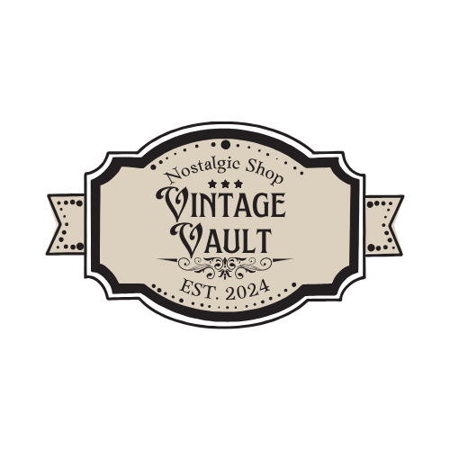
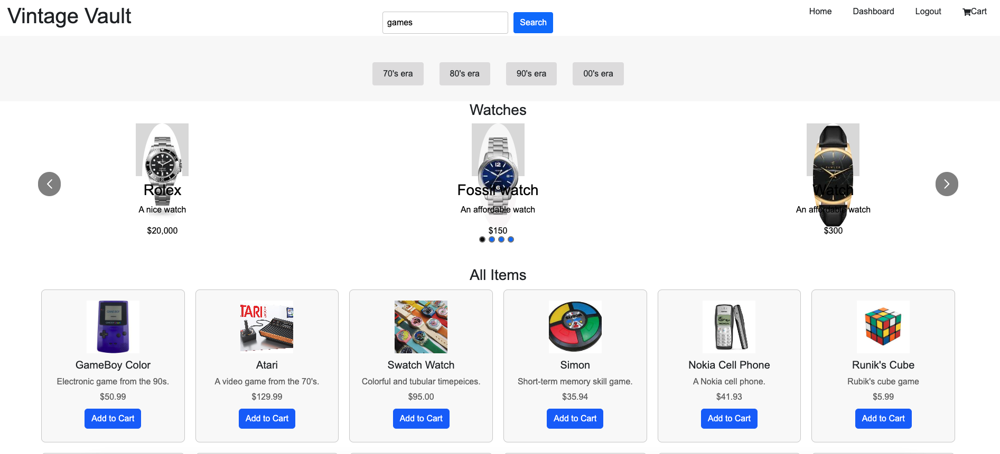
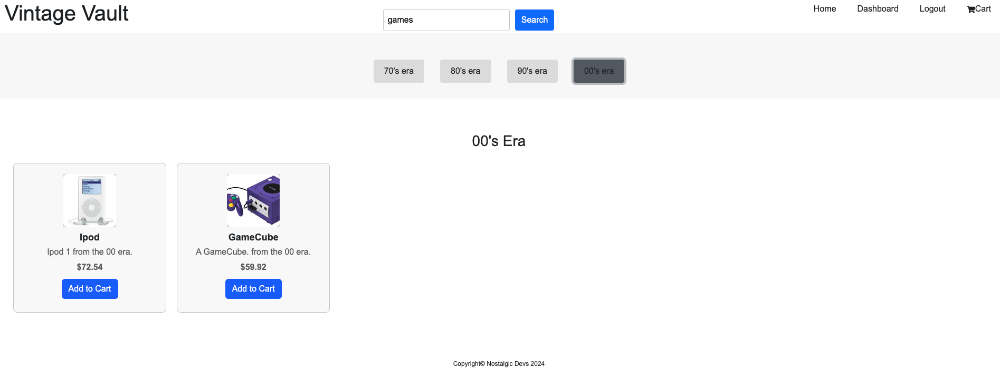
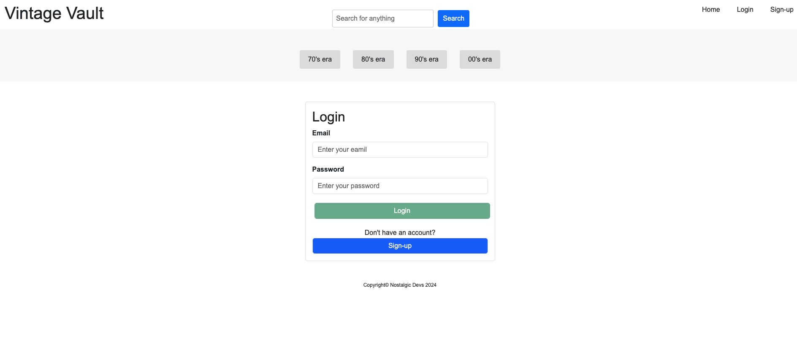
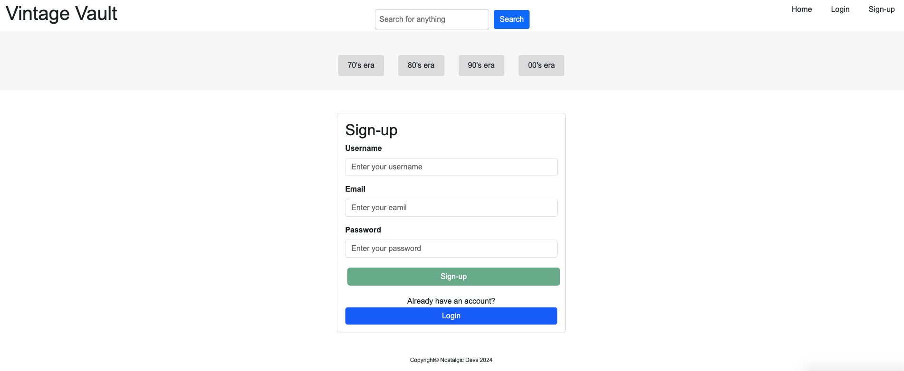

# Vintage-Vault

<div align="center">

  <!-- Add badges using the following format: -->
  <!-- (urlToGithubHere) -->

[](https://opensource.org/licenses/MIT)
[](https://github.com/Drew-Andersen/Vintage-VaultR/graphs/contributors)
[](https://github.com/https://github.com/Drew-Andersen/Vintage-Vault/network/members)
[](https://github.com/Drew-Andersen/Vintage-Vault/stargazers)
[](https://github.com/Drew-Andersen/Vintage-Vault/issues)
[]([Linkedin-links-here])

</div>

<!-- PROJECT LOGO -->

<div align="center">

  <h3 align="center">Vintage Vault</h3>

  <p align="center">
        <br />
    <a href="">
      
    </a><br />
    Brought to you by Nostalgic-Devs<br />
    <a href="https://github.com/Drew-Andersen/Vintage-Vault"><strong>Explore the docs »</strong></a>
    <br />
    <br />
    <a href="https://github.com/Drew-Andersen/Vintage-Vault">View Demo(Broken)</a>
    ·
    <a href="https://github.com/Drew-Andersen/Vintage-Vault">Report Bug</a>
    ·
    <a href="https://github.com/Drew-Andersen/Vintage-Vault">Request Feature</a>

  </p>
</div>

<!-- TABLE OF CONTENTS -->
<details>
  <summary>Table of Contents</summary>
  <ol>
    <li>
      <a href="#about-the-project">About The Project</a>
      <ul>
        <li><a href="#built-with">Built With</a></li>
      </ul>
    </li>
    <li>
      <a href="#getting-started">Getting Started</a>
      <ul>
        <li><a href="#installation">Installation</a></li>
      </ul>
    </li>
    <li><a href="#usage">Usage</a></li>
    <li><a href="#roadmap">Roadmap</a></li>
    <li><a href="#contributing">Contributing</a></li>
    <li><a href="#license">License</a></li>
    <li><a href="#contact">Contact</a></li>
    <li><a href="#acknowledgments">Acknowledgments</a></li>
  </ol>
</details>

<!-- ABOUT THE PROJECT -->

## About The Project

<!-- Add screenshots using the following format: -->
<!--  -->

This project was built using the MERN stack (MongoDB, Express, React, Node). <br />
Deployed Application located at https://vintage-vault.onrender.com/.

### Built using:

<div align="center">

[](https://javascript.info/)
[](https://www.mongodb.com/home)
[](https://nodejs.org/en/)
[](https://reactjs.org/docs/getting-started.html)
[](https://expressjs.com/)
[](https://www.npmjs.com/)
[](https://code.visualstudio.com/docs)
[](https://mui.com/)

</div>

<!-- GETTING STARTED -->

## Getting Started

Once completely built, this application will function as a deployed app on Render.

### Local Installation / Testing

1. Clone the rep

```
git clone git@github.com:Drew-Andersen/Vintage-Vault.git
```

2. Install dependencies

```
npm install
```

3. Seed the database

```
npm run seed
```

4. Launch the app in development environments

```
npm run develop
```

<!-- USAGE EXAMPLES -->

## Usage

<!-- Screenshots -->





<!-- ROADMAP -->

## Roadmap

#### MVP

- [ ] Front End

  - [x] Routing
  - [x] Map (Markers, Search area)
  - [x] User Auth
  - [x] User Profile Page
  - [x] Landing Page
  - [x] Error Page
  - [x] Login Form
  - [x] Sign Up Form
  - [x] Search

- [ ] Back End
  - [x] Typedefs
  - [x] Resolvers
  - [x] Seeds
  - [x] User Auth

#### Future Development

- [ ] 404 Page
- [ ] Stripe (checkout page)


See the [open issues] (https://github.com/Drew-Andersen/Vintage-Vault) for a full list of proposed features (and known issues).

<!-- CONTRIBUTING -->

## Contributing

Contributions are what make the open source community such an amazing place to learn, inspire, and create. Any contributions you make are **greatly appreciated**.

If you have a suggestion that would make this better, please fork the repo and create a pull request. You can also simply open an issue with the tag "enhancement".
Don't forget to give the project a star! Thanks again!

1. Fork the Project
2. Create your Feature Branch (git checkout -b feature/AmazingFeature)
3. Commit your Changes (git commit -m 'Add some AmazingFeature')
4. Push to the Branch (git push origin feature/AmazingFeature)
5. Open a Pull Request

<!-- LICENSE -->

## License

This project is licensed under the MIT license.

See LICENSE.txt for more information.

<!-- CONTACT -->

## Contact

[Drew Andersen](https://github.com/Drew-Andersen) - [andrewtandersen@gmail.com] <br />
[Xavier Leon](https://github.com/lateralmonster1) - [email address] <br />
[Setrige Crawford](https://github.com/SetCra123) - [email address] <br />
 


Project Links:

[Wireframe](https://docs.google.com/presentation/d/1NUg2MygvJb5myirMC37jNJ9gLDKaCSduznpV8PCzgLY/edit?usp=sharing)

[Github Repository](https://github.com/Drew-Andersen/Vintage-Vault)

[Deployment- link later](https://vintage-vault.onrender.com/)

<!-- ACKNOWLEDGMENTS -->

## Acknowledgments

